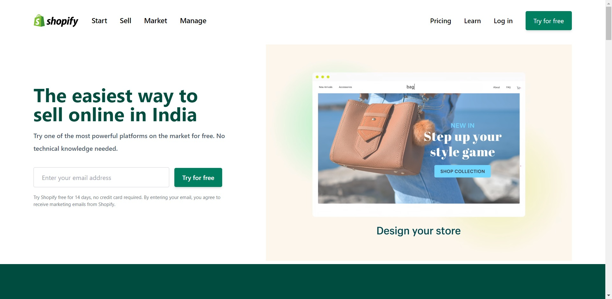

# Project 17 - HTML and Tailwind CSS

## Murtuza Rangwala

## What I learned from this Project?

- Learning Tailwind CSS and build the Shopify.in Clone

- It Takes 16hours to complete this Project.

## Live Link of the Project:

[Live Project Link](https://mk-shopify.netlify.app/)

## Output:

